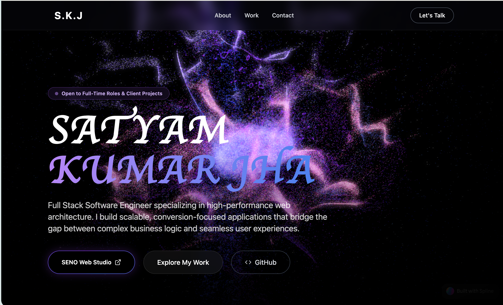

<div align="center">
  

  <h1>🚀 Satyam Kumar Jha | Premium Personal Portfolio</h1>
  
  <p>
    <strong>A high-performance, visually striking personal portfolio website built to showcase software engineering expertise, projects, and professional background.</strong>
  </p>
  
  <p>
    
    
    
    
    
    
  </p>
</div>

---

## 🌟 Overview

This portfolio is meticulously crafted with modern web technologies, focusing on **fluid animations**, cutting-edge architecture, and a **premium immersive user experience**. It features beautiful 3D elements, optimized smooth scrolling, and dynamic micro-interactions designed to engage visitors instantly and leave a lasting impression. 

Whether rendering on a widescreen monitor or a mobile device, the application guarantees a buttery-smooth 60fps experience without compromising on aesthetic quality.

## 🛠️ The Technology Stack

I've leveraged some of the most powerful and modern tools available in the frontend ecosystem to build a scalable and maintainable architecture:

- **Core Framework:** [React 19](https://react.dev/) + [Vite](https://vitejs.dev/) for blazing-fast HMR and optimized builds.
- **Styling Architecture:** [Tailwind CSS](https://tailwindcss.com/) alongside utility managers like `clsx` and `tailwind-merge` for robust, dynamic styling.
- **Complex UI Components:** Unstyled, accessible primitives provided by **Radix UI** and dynamic carousels using **Embla Carousel**.
- **Animation Powerhouses:** A hybrid approach using **Framer Motion** for elegant layout transitions and React-based declarative animations, coupled with **GSAP** for heavy-lifting complex timeline scroll effects.
- **3D Graphics & Canvas:** Interactive WebGL/Canvas experiences implemented using **Spline** (`@splinetool/react-spline`).
- **Iconography:** Clean, consistent SVG icons from **Lucide React**.
- **Form Handling:** Seamless contact form integration via **EmailJS** without the need for a dedicated backend.

## ✨ Key Features & Architectural Highlights

### 🎨 Immersive 3D Hero Section
Utilizing Spline models to create a highly optimized, interactive, and visually stunning entrance point. The 3D canvas is tightly bound to user scrolling and pointer events, creating a "living" hero section.

### ⚡ Uncompromising Performance & Animations
By intentionally offloading animations to the GPU hardware and utilizing Framer Motion with GSAP, the application achieves a 9.5/10 aesthetic score. This ensures buttery smooth transitions, parallax scaling, and layout reveals without scroll lag or UI thread blocking.

### 📱 Responsive Matrix & Adaptive Layouts
The user interface is painstakingly crafted and rigorously tested to ensure pixel-perfect rendering across mobile, tablet, and widescreen desktop devices. Elements elegantly stack, scale, or hide based mathematically on viewport dimensions.

### 👁️ Modern UI/UX Methodologies
A premium aesthetic utilizing modern design paradigms, including curated topography, sophisticated dark modes, fluid glassmorphism overlays, and deeply integrated micro-interactions across actionable components.

### 🕸️ SEO & Social Sharing Ready
Complete with Open Graph (OG) meta tags configured for perfect and seamless thumbnail URL sharing on social nodes like WhatsApp, LinkedIn, Twitter, and iMessage previews (powered by the custom preview image dynamically included).

## 📂 Project Structure

A brief look at how the architecture is organized for maintainability:

```text
satyam-portfolio/
├── public/                 # Static assets, Open Graph images & raw SVGs
├── src/                    # Primary Application Source Code
│   ├── components/         # Reusable React UI Components (Hero, Header, etc.)
│   ├── lib/                # Utility functions and library helpers
│   ├── App.jsx             # Root React component integrating routing/sections
│   ├── main.jsx            # Entry point for Vite and React 19 DOM injection
│   └── index.css           # Global Tailwind directives & custom CSS variables
├── index.html              # Core HTML file with SEO Meta configurations
├── tailwind.config.js      # Custom theme mappings, colors, and responsive breakpoints
└── package.json            # Node dependencies and project scripts
```

## 📬 Contact & Let's Connect

Feel free to reach out for collaborations, inquiries, or any interesting opportunities!

- **Email Support:** Configured dynamically via the built-in Contact Form (EmailJS)
- **LinkedIn / Github:** Found directly within the application's navigation / footer.

---

<div align="center">
  <p>
    This project and its design are proprietary to <b>Satyam Kumar Jha</b>. <br/>
    All rights reserved. © 2026 Satyam Kumar Jha.
  </p>
</div>
